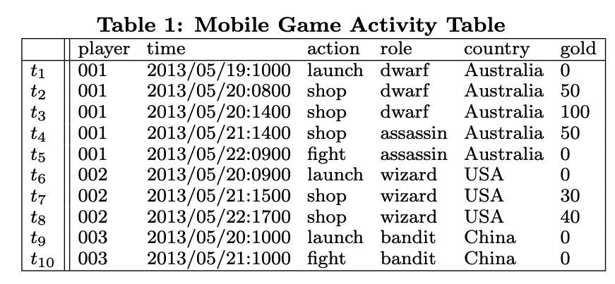
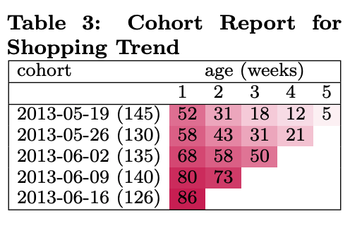
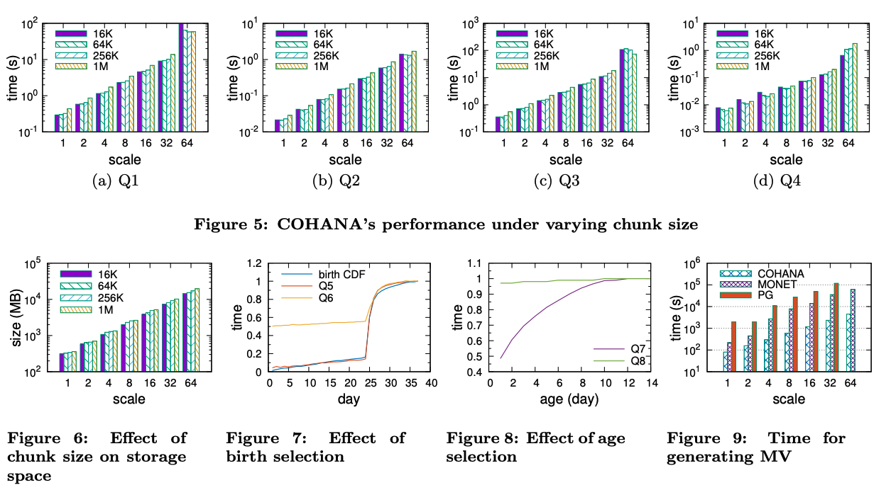
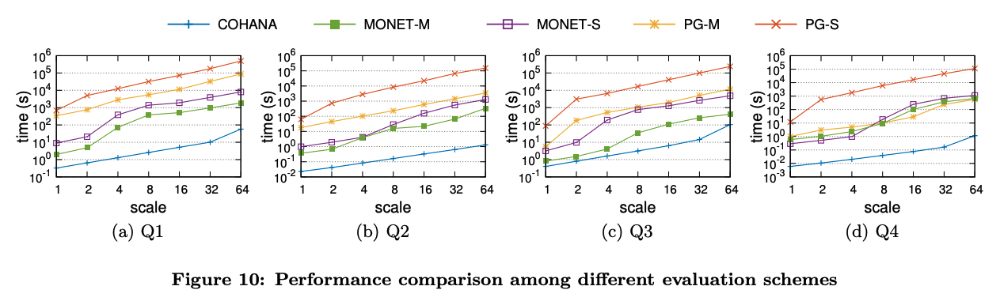

# Cohort Query Processing

>[Paper Link](http://www.vldb.org/pvldb/vol10/p1-ooi.pdf)

### Intro

Internet applications often accumulate a huge amount of activity data. When people want to use these data to do **Cohort analysis**, traditional database engines perform not well in executing queries. This Paper propose a new engine to optimize the query executor for this specific situation (Cohort analysis).

What's  the **Cohort analysis** ?

Cohort analysis, originally introduced in Social Science, is a data analytical technique for accessing the effects of aging on human behavior in a changing society.

More specifically:

Social scientists study the human behavioral trend in three steps:

- group users into cohorts 
- determine the age of user activities 
- compute aggreggations for each (cohort, age) bucket.

Cohort operation is  to capture the effect of social differences. Social scientists choose a particular action $e$ (called the birth action) and divide users into different groups (called cohorts) based on the first time (called birth time) that users performed $e$.

Example of cohort analysis.

>Back to our in-game shopping example, suppose we choose launch as the birth action and week as the cohort time bin interval, the activity tuples of player 001 are assigned to 2013-05-19 launch cohort since the activity tuple t1 (called birth activity tuple) indicates that player 001 first launched the game at that week. We further partition activity tuples in 2013-05-19 launch cohort into sub-partitions identified by age, and finally report the average gold spent for each (cohort, age) bucket. The result is shown in Table 3.

In above example, In order to query result of table 3, traditional query executor's shortcut:

- SQL statement is verbose, and its complexity renders it prone to mistake
- SQL statement requires many joins to perform the analysis task. 
- It requires manual tuning.

Even use the MV (materialized view)

- the cost of generating MV is still high
- the storage space for MV is huge
- the optimization is limited

For detailed concept introduction, pls check the original paper.

#### **How to optimize the query executor for cohort analysis?**

**The Activity Table Storage Format**

Cohana store an activity table D (like table 1) in the sorted order of its primary key (user, time, envent). two nice properties of this layout: 1) activity tuples of same user are clustered together 2) the activity tuples of each user are stored in a chronological order (time order property).

Cohana **first horizontally partition the activity table into multiple data chunks**, (activity tuples of each user are included in exactly one chunk, in each chunk, the activity tuples are stored column by column). It will be appropriate compression scheme for storing values based on type.

Compression method:

- For user column $A_u$, choose Run-Length-Encoding (RLE) Scheme
- For action column $A_e$, employ a two level compression scheme presented in for storing the value. Detailed Info check [Processing a trillion cells per mouse click](http://www.vldb.org/pvldb/vol5/p1436_alexanderhall_vldb2012.pdf). (Can be considered string type)
- For time column $A_t$, employ a two-level delta encoding scehme, for each column A of this type, store MIN and MAX value of A for the whole activity table as the global range. Then, for each data chunk, the MIN and MAX values are extracted as the chunk range from the segment of A in that chunk and persisted as well. (Can be considered integar type)

In scan method, there are some optimizations.

In ***TableScan*** Operation, it will skip user's activity tuple directly, according to the given situation.

In ***Cohort*** Operation, it will use the `SkipCurUser` and `GetNextUser` interface.

### Experiment

COHANA set different query situation and compare different query executor in these queries. It also study the effect of chunk on the performance of query executor.

We can see that increasing the chunk size also increases storage cost, because an increase in the size of a chunk will lead to more players included in that chunk.

We also can observe that cohort queries can be processed slightly faster under a smaller chunk size than a larger one. However, for large datasets, a larger chunk size can be a better choice. This is because the processing of queries is dominated by disk accesses, whose granularity is normally 4KB block. Compare to large chunk size, small chunk sie will lead to memory contention.

Figure 10 shows the  execution time that each system takes to execute these queries. As expected, the ***COHANA*** is able to perform extremely well not only on small datasets, but also on large datasets. This figure also shows the power of columnar storage in terms of cohort query processing time by an order of magnitude. 